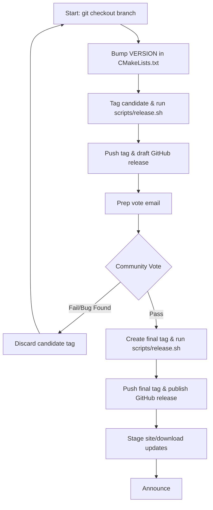

# Release Process for mod_http3

This document outlines the release engineering guidelines, verification steps, and release candidate workflow for `mod_http3`.

Only members of the Project Management Committee (PMC) and active Committers can serve as Release Managers (RM) or cast binding votes on releases. However, testing and feedback from all developers is highly encouraged.

---

## 1. Release Classifications and Versioning

We adopt the Apache HTTP Server's minor versioning strategy:
- **Odd-numbered minor versions** (e.g., `1.1.x`) are used for active development, alpha, and beta releases.
  - **Alpha**: Early development releases. May contain unfinished features or minor API instability.
  - **Beta**: Feature-complete development releases undergoing integration testing and stabilization.
- **Even-numbered minor versions** (e.g., `1.2.x`) are designated for **General Availability (GA)** stable releases. GA releases replace all previous releases, and their public interfaces remain stable throughout their minor version lifecycle.

---

## 2. Voting on Releases

For a release candidate to be officially published:
- At least **three (3) active PMC members** must vote affirmatively (`+1`).
- There must be **more positive (`+1`) than negative (`-1`) votes**.
- Unlike standard technical commits, there is no "veto" on release votes. If an issue is found, a new release candidate must be prepared.
- Source code archives (tarballs) are the only authoritative release artifacts. Binaries may be provided for convenience but must be generated from the exact source code of the approved release.

---

## 3. Release Workflow

Release candidates are prepared from a clean checkout of the target branch. We use standard `git` and `gh` (GitHub CLI) commands for version control, and a simple helper script (`scripts/release.sh`) to build, hash, and sign the artifacts.



### Step-by-Step Process

1. **Prepare Candidate**:
   Ensure you have a clean worktree. Bump the `VERSION` field in `project(mod_http3 VERSION X.Y.Z)` at the top of [CMakeLists.txt](../CMakeLists.txt), update `CHANGES`, and commit. Then create the local candidate tag (e.g., `vX.Y.Z-rc1`):
   ```sh
   git tag -a vX.Y.Z-rc1 -m "mod_http3 X.Y.Z release candidate 1"
   ```

2. **Generate Artifacts & Sign**:
   Run the release script to build the release artifacts, generate SHA256 checksums, and create detached PGP signatures (`.asc`):
   ```sh
   ./scripts/release.sh
   ```
   **Note:** You must have `gpg` and `sha256sum` installed, and an active GPG key. If you have multiple keys, you can specify one using `export GPG_KEY=<fingerprint>`.

   This will create the following files in `build-release/dist/` (each with a `.sha256` and `.asc`):
   - `mod_http3-X.Y.Z.tar.gz` / `mod_http3-X.Y.Z.zip` — source snapshots (the authoritative release artifacts)
   - `mod_http3-X.Y.Z-linux-<arch>.tar.gz` / `mod_http3-X.Y.Z-linux-<arch>.zip` — generic Linux binaries
   - `mod_http3-X.Y.Z.<arch>.rpm` — RHEL/Fedora layout
   - `mod_http3_X.Y.Z_<arch>.deb` — Debian/Ubuntu layout

3. **Stage Candidate and Call Vote**:
   Push the candidate tag to the repository:
   ```sh
   git push origin vX.Y.Z-rc1
   ```
   Create a draft prerelease on GitHub and upload all artifacts from `build-release/dist/`:
   ```sh
   gh release create vX.Y.Z-rc1 --draft --prerelease --title "mod_http3 X.Y.Z-rc1" build-release/dist/*
   ```
   Draft the vote email by hand, referencing the tag, tarball URL, and checksums. Send the vote proposal to the developer list to open the 72-hour vote.

4. **Handling Failures**:
   If the community finds a bug or votes down the candidate, remove the GitHub draft release and the local/remote tags:
   ```sh
   gh release delete vX.Y.Z-rc1 --yes
   git push origin --delete vX.Y.Z-rc1
   git tag -d vX.Y.Z-rc1
   ```
   Apply the fix, update your checkout, and restart from step 1 using the next candidate suffix (e.g., `rc2`).

5. **Publish Approved Release**:
   Once the vote passes, create the final tag `vX.Y.Z` and push it:
   ```sh
   git tag -a vX.Y.Z -m "mod_http3 X.Y.Z release"
   git push origin vX.Y.Z
   ```
   Re-run `./scripts/release.sh` to build the final artifacts, then create the final GitHub release:
   ```sh
   gh release create vX.Y.Z --title "mod_http3 X.Y.Z" build-release/dist/*
   ```

6. **Stage and Commit Site Updates**:
   Update website documentation, download pages, and CVE details, then commit them to publish.

7. **Announce**:
   Send announcement emails and move any relevant CVE issues to the public domain.

---

## 4. Verifying Releases

Users and developers should verify the integrity and origin of downloaded releases using PGP signatures and SHA hashes.

### Verifying PGP Signatures
1. Import the author's public key from a public keyserver. You can find the key on [keys.openpgp.org](https://keys.openpgp.org/) or [keyserver.ubuntu.com](https://keyserver.ubuntu.com/). For example:
   ```sh
   gpg --keyserver hkps://keys.openpgp.org --recv-keys <KEY_ID>
   ```
2. Verify the detached signatures for each artifact:
   ```sh
   for sig in *.asc; do
     if [[ "$sig" == "SHA256SUMS.asc" ]]; then
       gpg --verify SHA256SUMS.asc SHA256SUMS
     else
       artifact="${sig%.asc}"
       gpg --verify "$sig" "$artifact"
     fi
   done
   ```
   Ensure the output reports a `Good signature` from an authorized committer for each artifact.

### Verifying Checksums
First verify that the signed manifest authenticates every individual checksum file:
```sh
sha256sum -c SHA256SUMS
```
Then verify every artifact against its individual checksum:
```sh
for checksum in *.sha256; do sha256sum -c "$checksum"; done
```

---

## 5. Committing Security Fixes

- Vulnerability fixes are staged in a private security repository first to allow testing.
- The commit of the fix should never obscure the security nature of the change.
- Commit messages must include the appropriate tracking details (such as CVE number) and the `CHANGES` entry should place the security fix at the top of the release list:
  ```
  *) SECURITY: CVE-YYYY-NNNN (cve.mitre.org)
     mod_http3: Fix potential connection stall when receiving malformed HTTP/3 frames.
  ```
